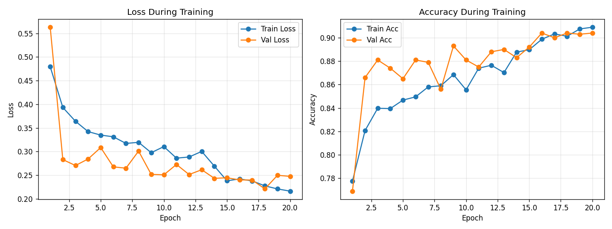
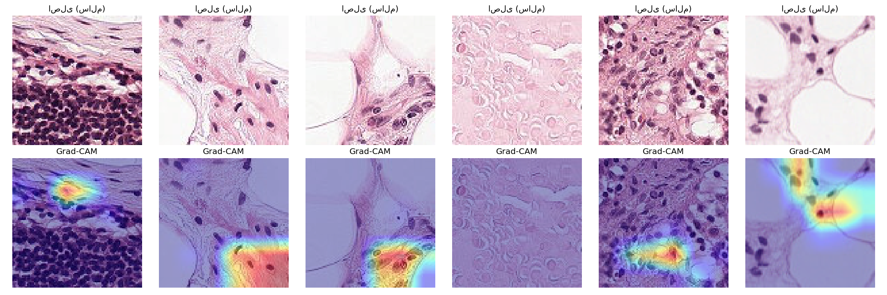

# Interpretable Breast Cancer Detection using Transfer Learning and Grad-CAM

## Overview

This project is about classifying histopathology images as tumor or
healthy tissue, using the PCam (PatchCamelyon) dataset. I trained a
ResNet-18 with transfer learning for the classification part, and used
Grad-CAM on top of it so the model's decisions aren't just a black box.

This is the first of two projects I'm working on around breast cancer —
the second one looks at gene expression data instead of images. See
[Future Work](#future-work) for how I'm hoping to connect the two later.

## Problem Statement

Just classifying an image as "tumor" or "healthy" isn't really enough on
its own, especially for something medical. If a model is going to be
useful, you also need some way to check *why* it made that call. That's
what Grad-CAM is for here — it shows which parts of the image the model
was actually looking at when it made a prediction.

## Data Preparation

I used 5,000 samples from PCam — 4,000 for training, 1,000 for
validation. The training set gets augmented (flips and rotation), the
validation set doesn't, since we want validation to reflect what the
model would actually see on new images.

## Model Architecture

ResNet-18, pretrained on ImageNet. I swapped out the original 1000-class
FC layer for a single output neuron, since this is just a binary
tumor/healthy decision. Most of the pretrained weights get reused —
that's the whole point of transfer learning here, we don't have anywhere
near enough data to train a ResNet from scratch.

## Training Strategy

Loss is `BCEWithLogitsLoss` (fits a single-logit binary setup), optimizer
is Adam. After every epoch I check performance on the validation set, and
`ReduceLROnPlateau` drops the learning rate if validation loss stops
improving. Whatever checkpoint has the lowest validation loss gets saved
as the "best" one.

### Training Configuration

| Parameter | Value |
|---|---|
| Dataset samples | 5,000 |
| Training samples | 4,000 |
| Validation samples | 1,000 |
| Epochs | 20 |
| Batch size | 16 |
| Optimizer | Adam |
| Initial learning rate | 1e-3 |
| Freeze mode | Partial |

## Results

Best validation accuracy was 90.4%, with the lowest validation loss
(0.2212) showing up at epoch 18.

Looking at the curves, both loss and accuracy kept improving through
training. After epoch 18 validation loss ticked up a bit while accuracy
stayed around 90%, so I kept the epoch-18 checkpoint as the final model
instead of the very last epoch.

### Training Results

| Metric | Value |
|---|---|
| Best Validation Accuracy | 90.4% |
| Best Validation Loss | 0.2212 |
| Best Epoch | 18 |
| Final Training Accuracy | 90.9% |
| Final Validation Accuracy | 90.4% |



## Test Set Evaluation

Validation accuracy on its own is a bit misleading here, since it's also
what I used to pick the best checkpoint. To get a fairer number, I ran
the final model on PCam's official test split — data the model never saw
during training or checkpoint selection at all.

| Metric | Validation | Official Test Set |
|---|---|---|
| Accuracy | 90.4% | ~82–84% |
| Precision | — | ~0.90–0.92 |
| Recall | — | ~0.74–0.75 |
| F1-score | — | ~0.81–0.82 |
| ROC-AUC | — | ~0.92–0.93 |

So there's a real gap between validation and test accuracy. I dig into
why in [Limitations](#limitations) below — figuring that out was
honestly one of the more useful parts of doing this project.

## Explainability with Grad-CAM

I generated the Grad-CAM heatmaps from `layer3` instead of the usual
`layer4`. Reason: PCam images are only 96×96 pixels, so by the time you
get to `layer4` the activation map has shrunk down to 3×3 — way too
small to show anything useful once you upscale it back to image size.
`layer3` gives a 6×6 map instead, which is still coarse but at least
shows *something*.

The heatmaps mostly light up on areas with dense clusters of nuclei,
which lines up with what pathologists actually look for when checking
for malignancy — so at least the model isn't picking up on something
random.



## Limitations

- **Not much training data.** Only 5,000 of the 262,144 images in the
  full PCam training set got used — see
  [Environment & Access Constraints](#environment--access-constraints)
  for why.
- **Gap between validation and test accuracy.** Validation sat around
  90%, test came in closer to 82-84%. Part of this turned out to be a
  data sampling issue — grabbing the first 5,000 samples in the dataset's
  stored order meant pulling from a limited number of slides, since PCam
  images are ordered by source slide. Sampling spread out across the full
  training range helped close the gap a bit, but not all the way. This
  matches what's reported elsewhere too — PCam accuracy tends to scale
  with how many distinct slides you train on, not just how many patches.
  With the full dataset this gap would probably shrink a lot more.
- **Recall is lower than I'd like.** The model misses more actual tumors
  (recall ~0.74) than it falsely flags healthy tissue as tumor (precision
  ~0.90-0.92). For anything resembling real screening use, that's the
  wrong direction to be off in, since missing a real tumor is worse than
  a false alarm.

## Environment & Access Constraints

Worth mentioning since it shaped a lot of decisions here: both Google
Colab and Kaggle are blocked in my region, so I needed a VPN just to get
GPU access for training. The original PCam HDF5 files (hosted on Google
Drive) were also unreachable because of download quota limits, so I
ended up pulling the data from a Hugging Face Hub mirror
(`1aurent/PatchCamelyon`) instead — and only a subset of it, not the full
262,144 images.

Built with Python 3.12. Main libraries: PyTorch, Torchvision, Hugging
Face `datasets`, scikit-learn, and Matplotlib.

## Future Work

## Future Work

- **Quantitative check on the Grad-CAM heatmaps.** Right now the claim
  that Grad-CAM "focuses on dense nuclei regions" is just something I
  can see by eye — it'd be worth actually measuring it. The plan is to
  segment cell nuclei with a classic image processing approach (color
  thresholding + watershed, using scikit-image or OpenCV — no deep
  learning needed since H&E staining makes nuclei fairly distinct by
  color), turn that into a binary map of nucleus locations, and then
  compare it directly against the Grad-CAM heatmap with something like
  IoU or a spatial correlation score. That'd turn "the heatmaps look
  reasonable" into an actual number I can report.

- **Looking closer at what the model gets wrong.** The evaluation run
  turned up 671 false negatives — tumor images the model called healthy.
  I haven't looked at those individually yet. Worth pulling them out and
  checking for anything in common (lighting, lower nucleus density,
  staining that's off), and running Grad-CAM on them specifically to see
  where the model *was* looking when it got it wrong, not just when it
  got it right.

- Train on the full PCam dataset — should help close the validation/test
  gap discussed above.
- Try stain normalization (Macenko method) to reduce slide-to-slide color
  differences, which is likely part of what's driving that gap.
- Connect this to my other project — a GNN predicting breast cancer
  subtypes from gene expression data. The idea is to check whether the
  regions Grad-CAM highlights line up with known PAM50 molecular
  subtypes, and eventually combine image features with gene expression
  features in one model.

## Project Structure

```
interpretable-breast-cancer-detection/
├── dataset.py           # PCam dataset loading (HF Hub + diverse sampling)
├── model.py              # ResNet-18 with configurable layer freezing
├── train.py               # Training loop, LR scheduling, checkpointing
├── evaluate.py            # Held-out test set evaluation
├── grad_cam.py            # Grad-CAM implementation and visualization
├── chart_1.png            # Training/validation loss & accuracy curves
├── gradcam_examples.png   # Grad-CAM visualization examples
├── requirements.txt
├── README.md
└── PROJECT_SUMMARY.md
```

Model checkpoints (`.pth` files) get generated locally when you run
`train.py` — they're not tracked in this repo since they're too big.

## Installation

```bash
pip install -r requirements.txt
```

## Running the Project

```bash
# Train the model
python train.py

# Evaluate on the official held-out test set
python evaluate.py

# Generate Grad-CAM visualizations
python grad_cam.py
```

**Note:** I trained this on Google Colab's free GPU tier. The code isn't
GPU-only though — it'll run on CPU too, just a lot slower.

## Data

- **Dataset:** [PatchCamelyon (PCam)](https://github.com/basveeling/pcam) —
  96×96 histopathology patches, binary tumor/normal labels.
- **Source used:** [`1aurent/PatchCamelyon`](https://huggingface.co/datasets/1aurent/PatchCamelyon)
  on the Hugging Face Hub.

## References

- Selvaraju, R. R., et al. (2017). *Grad-CAM: Visual Explanations from
  Deep Networks via Gradient-based Localization.* ICCV.
- Veeling, B. S., et al. (2018). *Rotation Equivariant CNNs for Digital
  Pathology.* MICCAI.
